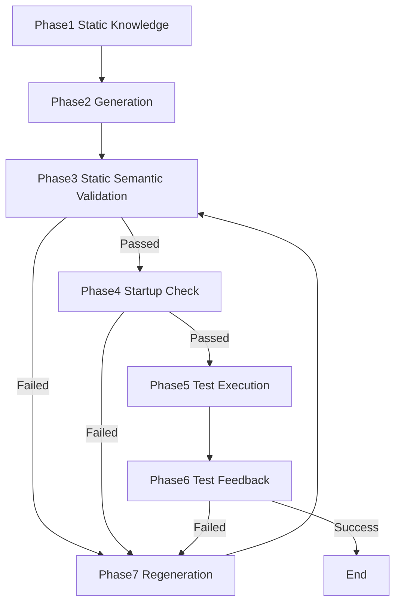

# 📘 AI Era Language Ecosystem Evaluation Model
> A Framework Based on Fixability and Semantic Transparency

---

## 🌟 Overview

This repository provides a practical diagnostic prompt for diagnosing causes of AI misinference during code generation and evaluating countermeasures (prompt improvements, additional metadata, explicit validation instructions, etc.) that should be given to AI. Developers can use this prompt to obtain diagnostics and countermeasures tailored to their project's specific context.

**🚀 Want to diagnose your project now? →** [Quick Start Guide](#-quick-start-diagnose-your-project)

Furthermore, as a framework for thinking to theoretically understand why AI misinfers, we devised a language ecosystem evaluation model.
This framework provides a novel approach to evaluating programming language ecosystems in the **AI coding era**. Unlike traditional metrics focused on syntax or performance, our model prioritizes **"fixability"** — the ability of an ecosystem to support AI's correction loop through rich semantic information.

**Key Insight:**  
In AI-assisted development, language strength is determined not by initial code generation quality, but by the ecosystem's capacity to provide semantic transparency for iterative correction.

---

## 📌 Project Status

This framework was developed as a **thought experiment** based on practical experience and observations in AI-assisted coding.

**Current Status:**
- ✅ Structured as a theoretical framework
- 🔄 Empirical validation in progress
- 💬 Community-driven extensions welcome

**Design Philosophy:**
- **Tool-agnostic:** Stable across changing AI coding agents and inference models
- **Language-agnostic:** Applicable regardless of programming language evolution or type (static/dynamic)
- **Focus on structure:** Identifies mis-inference-prone structures, not specific implementations
- **Long-term stability:** Principles over concrete tools that rapidly evolve

**Scope:**
- ✅ Structural vulnerabilities that cause AI mis-inference
- ⚠️ Non-functional requirements (security, performance) are distributed across the 9 axes as they relate to mis-inference
- ℹ️ Project-specific non-functional requirements may require separate evaluation frameworks

**Future Direction:**  
This framework's structural approach can be adapted to identify mis-inference patterns in other domains (security, performance, etc.) as domain-specific evaluation frameworks.

**How to Use:**
- As a starting point for language selection discussions
- For experimental evaluation in actual projects
- As inspiration for developing your own evaluation criteria

---

## 🚀 Quick Start: Diagnose Your Project

If you want to diagnose situations where AI mis-infers during code generation in your actual project, use these two documents:

### **📋 Use the Diagnostic Prompt**

[diagnostic_prompt.md](./diagnostic_prompt.md) can be used with any AI model to diagnose your project's language ecosystem.

**How to use:**
1. Copy the prompt
2. Add your project context (language, version, major frameworks, etc.)
3. Run it through an AI model
4. Review the 9-axis diagnostic results

**Use the results to:**
- Identify points where AI is likely to stumble
- Understand structural vulnerabilities to watch for during code generation
- Inform your AGENT.md or prompt design

### **📊 Reference Diagnostic Samples**

[samples/](./samples/) contains examples of diagnostic results for actual language configurations.

**Available samples:**
- C# + .NET
- Java + Spring Boot
- Python + Django/FastAPI

Referencing samples similar to your project configuration helps you understand what diagnostic results look like.

**💡 Tip:** For theoretical background, see the "📚 Documentation" section below.

---

## 📚 Documentation

### **Framework Documents**

This repository contains six interconnected document types:

#### **1. Theoretical Framework ([model.md](./model.md))**
- **Purpose:** Theoretical foundation with 4-layer architecture and 9-axis evaluation
- **Structure:** 4 Semantic Layers × 9 Evaluation Axes × Verification Loop
- **Audience:** Researchers, framework designers, those seeking deep understanding

#### **2. Usage Guide ([model-usage-guide.md](./model-usage-guide.md))**
- **Purpose:** Explains how to use and customize the framework
- **Structure:** How to use the 3 perspectives (4 Layers, 9 Axes, 7 Phases) and convert to project-specific evaluation axes
- **Audience:** Framework users, those considering customization
- **Key Content:**
  - Independence and usage of the model's three perspectives
  - Recommended usage by user type
  - Conversion process to project-specific evaluation axes (7 steps)
  - Customization principles

#### **3. Philosophical Principles ([philosophy.md](./philosophy.md))**
- **Purpose:** Summarizes the framework's design philosophy and principles for long-term stability
- **Structure:** Principles such as neutrality in AI-assisted coding, respect for values, structural focus, etc.
- **Audience:** Those who want to understand the philosophical background of the framework, designers, researchers

#### **4. Diagnostic Tool ([diagnostic_prompt.md](./diagnostic_prompt.md))**
- **Purpose:** Practical diagnostic tool that transforms the 4-layer model into 9 diagnostic axes
- **Structure:** 9 diagnostic axes for identifying AI mis-inference points
- **Audience:** AI coding assistant users, project teams, developers writing AGENT.md
- **Note:** Focuses on the 9 axes; the 4-layer representation is abstracted away for practical use
- **Important:**
  - ⚠️ **Any AI model can be used** for diagnostics (not limited to specific vendors)
  - 💡 **Use with appropriate context** and project-specific information for best results
  - 📊 **Diagnostic quality depends** on the AI model's training data and capabilities
  - 🔄 **Results may vary** between different AI models or versions

#### **5. Diagnostic Results ([samples/](./samples/))**
- **Purpose:** Real-world examples of applying the diagnostic prompt to specific language configurations
- **Structure:** Language + version + context → 9-axis diagnostic results
- **Audience:** Users seeking concrete examples, teams evaluating their tech stack

#### **6. Thought Process ([model-thought-process.md](./model-thought-process.md))**
- **Purpose:** Chronicles the development journey behind this framework
- **Structure:** A narrative essay tracing the evolution from initial questions to the final 9-axis model
- **Audience:** Those interested in the reasoning process, framework designers, researchers
- **Note:** Written in an accessible essay style rather than technical documentation
- **Highlights:**
  - The paradigm shift from "generation quality" to "fixability"
  - The TCP/IP analogy for understanding correction loops
  - Discovery of the dual perspective (human vs. AI)
  - Recognition that syntax is UI for AI

**Relationship:**
```
Theoretical Model (model.md)
  ↓ Explains usage and customization
Usage Guide (model-usage-guide.md)
  ↓ Explains design philosophy
Philosophical Principles (philosophy.md)
  ↓ Practical transformation
Diagnostic Prompt (diagnostic_prompt.md)
  ↓ Applied to real projects
Diagnostic Samples (samples/)

Thought Process (model-thought-process.md)
  ↓ Explains the reasoning behind
Theoretical Model (model.md)
```

### **Language Versions**

- **[English Version](./model.md)** - Full framework documentation
- **[日本語版](./ja/README.md)** - 日本語ドキュメント

---

## 🎯 Core Philosophy

### **The Essence of AI Coding is "Fixability"**

AI coding is not about "producing correct code in one shot."  
It's about maintaining a stable correction loop:

```
Generation → Verification → Feedback → Regeneration
```

What matters is:
- ✅ The ability to fix errors when they occur
- ✅ The ability to provide AI with information needed for fixes

This requires not just language specifications, but **rich semantic information** from the entire ecosystem: language, runtime, toolchain, and community.

---

## 👤 Author's Perspective

This framework was developed from **40+ years of programming experience** across multiple languages and ecosystems.

### **Background**

The author has witnessed and participated in:
- The evolution of language design philosophies
- Trade-offs made for backward compatibility
- Cultural differences in how communities prioritize features
- The historical context behind major language decisions

### **Core Belief: Design Choices Reflect Values, Not Quality**

Programming languages differ not because one is "better," but because they embody **different values and priorities**.

#### **Examples of Design Philosophy**

**Java's Type Erasure**  
The decision to use type erasure for generics reflects Java's commitment to "write once, run anywhere" — maintaining backward compatibility with existing JVMs was more important than runtime type information. This is Java's **pride in ecosystem stability**.

**C#'s MSIL Changes for Generics**  
C# chose to modify the runtime (MSIL) to support full generic type information, reflecting a **pragmatic approach**: preserve backward compatibility when possible, but evolve the platform when necessary for better developer experience.

**Python's Breaking Changes**  
Python's willingness to introduce breaking changes (e.g., Python 2 → 3) prioritizes **language evolution and improvement** over absolute stability. Progress over compatibility is a cultural value.

#### **None of These is "Wrong"**

- Java protects its ecosystem's long-term stability  
- C# balances evolution with practical constraints  
- Python embraces progress and modernization  

**These are value choices, not quality rankings.**

### **From AI's Perspective**

This framework identifies how these choices affect AI's correction loop:

- **Type erasure** → AI needs runtime tests for type validation  
- **MSIL generics** → AI can rely on rich compile-time metadata  
- **Breaking changes** → AI needs version-aware knowledge  

**These are structural observations, not judgments.**

The goal is to help AI work better with each ecosystem's unique characteristics, not to declare one superior to another.

### **Why This Matters**

Without understanding the historical context and cultural values:
- We risk misinterpreting design decisions as "mistakes"
- We might try to "fix" what is actually a deliberate trade-off
- We lose the richness that comes from diverse approaches

This framework respects that diversity while helping AI navigate it effectively.

---

## 🧩 Framework Structure

### **4 Layers × 9 Axes × Verification Loop**

#### **4 Semantic Layers**
1. **Layer1 Core Layer** - Type system, scope rules, memory model
2. **Layer2 Service Layer** - AST, LSP, static analysis APIs
3. **Layer3 Dependency Layer** - Package management, standard library
4. **Layer4 Community Layer** - OSS, Q&A, best practices

#### **9 Evaluation Axes**
1. **Axis1 Public Knowledge Availability** - Quality and quantity as training data
2. **Axis2 Static Semantic Consistency** - Consistency of types, AST, scopes
3. **Axis3 Semantic Metadata Richness** - Type annotations, LSP, contracts
4. **Axis4 Semantic Access & Automation** - Roslyn, tsserver, Symbol API
5. **Axis5 Runtime Semantic Continuity** - Consistency between implementation and runtime
6. **Axis6 Dependency Stability** - Version management, ABI compatibility
7. **Axis7 Runtime Specification Conformance** - API specs, RFC compliance
8. **Axis8 Compatibility Culture** - Backward compatibility, LTS
9. **Axis9 Semantic Extensibility** - Interfaces, plugins, modules

#### **7-Phase Verification Loop**
1. **Phase1 Static Knowledge** - AI training data, language specs, common patterns
2. **Phase2 Generation** - Initial code generation by AI
3. **Phase3 Static Semantic Verification** - Type checking, syntax validation, linter
4. **Phase4 Startup Check** - Build, dependency resolution, startup confirmation
5. **Phase5 Test Execution** - Unit tests, integration tests
6. **Phase6 Test Feedback** - Test results, error messages, traces
7. **Phase7 Regeneration** - Fix based on feedback and loop back to Phase3



---

## 💡 Key Contributions

### **1. Fixability-Centered Evaluation**
Traditional metrics focus on syntax or performance.  
This model focuses on how well an ecosystem supports AI's **correction loop**.

### **2. Unified View of Static/Dynamic Languages**
Compilers are redefined as **semantic verification engines**, enabling unified evaluation of static and dynamic languages.

### **3. Qualitative Over Quantitative**
No ranking or scoring.  
Different use cases require different trade-offs.

### **4. Thought Experiment Transparency**
We're honest: this is a hypothesis based on practical observations, not empirical research.

---

## 🎯 How to Use This Framework

### **For Language Selection**
Use as a starting point for discussions:
- Which axes matter for your project?
- What trade-offs are acceptable?
- How does your ecosystem support AI coding?

### **For Ecosystem Improvement**
Identify gaps in semantic transparency:
- Missing API documentation?
- Inconsistent runtime behavior?
- Poor LSP support?

### **For AI-Powered Diagnostics**
Use [diagnostic_prompt.md](./diagnostic_prompt.md) with any AI model:

**Best Practices:**
1. **Provide context:** Include language version, framework, and project-specific details
2. **Use multiple models:** Different AI models may highlight different aspects
3. **Focus on patterns:** Look for structural observations, not rankings
4. **Update regularly:** Re-run diagnostics when dependencies change

**Recommended Usage:**
```
Trigger diagnostics:
- At project start
- When dependencies are updated
- When adopting new language features
- During architecture reviews
```

### **For Research**
Test the hypothesis:
- Does "fixability" correlate with AI coding success?
- Which axes have the strongest impact?
- How do different AI tools behave?

---

## 🤝 About This Repository

This is a **snapshot of a thought experiment** — published as-is for the community to use and extend.

**Feel free to:**
- Fork it
- Extend it
- Apply it to your projects
- Share your results

**Note:**  
This repository may not be actively maintained. If you find value in the framework, consider creating your own version or contributing to community discussions.

This is a starting point, not a finished product.  
The community is encouraged to build upon it independently.

---

## 📜 License

This project is licensed under the **MIT License** - see the [LICENSE](./LICENSE) file for details.

Copyright (c) 2025 Masaki Honda

---

## 🙏 Acknowledgments

This thought experiment emerged from years of observing various language ecosystems in real-world projects.

Special thanks to:
- The open-source communities whose work made this analysis possible
- Colleagues and clients who provided the practical contexts for these observations
- The broader programming language community for creating diverse ecosystems worth studying

This framework stands on the shoulders of decades of language design, tooling development, and community building across all the ecosystems mentioned.

---

## 🔗 Related Resources

**Read the full framework:**
- [English Documentation](./model.md)
- [日本語ドキュメント](./ja/model.md)

**Keywords:**  
AI-assisted coding, semantic information, language ecosystems, fixability, verification loop, semantic transparency
