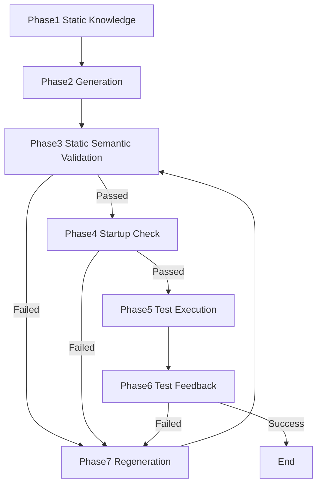

# 📘 AI 時代の言語エコシステム評価モデル
> 修正可能性と意味論的透明性に基づくフレームワーク

---

## 🌟 概要

本リポジトリは、AI がコード生成時に誤推論しやすい原因を診断し、AI に与えるべき対策（プロンプトの改善、追加メタデータ、明示的な検証指示など）を評価するための実用的な診断プロンプトを提供しています。開発者はこのプロンプトを使って、プロジェクト固有のコンテキストに合わせた診断と対策案を得ることができます。

**🚀 すぐに診断を始めたい方は →** [診断クイックスタート](#-すぐに診断を始めたい方へ)

さらに、なぜ AI が誤推論するのかを理論的に理解するための思考の枠組みとして言語エコシステム評価モデルを考案しました。
本フレームワークは、**AI コーディング時代**におけるプログラミング言語エコシステムを評価する新しいアプローチを提供します。構文や性能に焦点を当てた従来の評価指標とは異なり、本モデルは **「修正可能性（Fixability）」** を優先します――つまり、豊富な意味論情報を通じて AI の修正ループを支援するエコシステムの能力です。

**核心的洞察：**  
AI 支援開発において、言語の強さは初回コード生成の品質ではなく、反復的な修正のための意味論的透明性を提供するエコシステムの能力によって決まります。

---

## 📌 プロジェクトの状態

本フレームワークは、AI 支援コーディングにおける実務経験と観察に基づく **思考実験** として開発されました。

**現状：**
- ✅ 理論的枠組みとして構造化済み
- 🔄 実証的検証は進行中
- 💬 コミュニティによる拡張を歓迎

**設計思想：**
- **ツール非依存：** AI コーディングエージェントや推論モデルが変わっても安定して使用可能
- **言語非依存：** プログラミング言語の進化、種類（静的・動的）に関係なく適用可能
- **構造に焦点：** 具体的な実装ではなく、誤推論を起こしやすい構造を特定
- **長期安定性：** 急速に進化する具体的ツールではなく、原則を重視

**対象範囲：**
- ✅ AI の誤推論を引き起こす構造的脆弱性
- ⚠️ 非機能要件（セキュリティ、パフォーマンス等）は、誤推論との関連において 9 軸に分散して含まれる
- ℹ️ プロジェクト固有の非機能要件は、別の評価フレームワークが必要となる場合がある

**将来の方向性：**  
本フレームワークの構造的アプローチは、他の領域（セキュリティ、パフォーマンス等）における誤推論パターンの特定にも、観点別評価フレームワークとして応用可能です。

**ご活用方法：**
- 言語選定の議論のたたき台として
- 実際のプロジェクトでの試験的評価として
- 独自の評価基準の開発のヒントとして

---

## 🚀 すぐに診断を始めたい方へ

実際のプロジェクトで AI がコード生成時に誤推論する状況を診断したい場合は、以下の2つのドキュメントをご利用ください：

### **📋 診断プロンプトを使う**

[diagnostic_prompt.md](./diagnostic_prompt.md) を任意の AI モデルに渡して、プロジェクトの言語エコシステムを診断できます。

**使い方：**
1. プロンプトをコピー
2. プロジェクトのコンテキスト（言語、バージョン、主要フレームワーク等）を追加
3. AI モデルに実行させる
4. 9軸の診断結果を確認

**診断結果の活用：**
- AI がつまずきやすいポイントの特定
- コード生成時に注意すべき構造的な脆弱性の把握
- AGENT.md やプロンプト設計への反映

### **📊 診断サンプルを参照する**

[samples/](../samples/) には、実際の言語構成に対する診断結果の例が含まれています。

**利用可能なサンプル：**
- C# + .NET
- Java + Spring Boot
- Python + Django/FastAPI

自分のプロジェクトと似た構成のサンプルを参照することで、診断結果のイメージをつかめます。

**💡 ヒント：** 理論的背景を理解したい場合は、このあとの「📚 ドキュメント」セクションをご覧ください。

---

## 📚 ドキュメント

### **フレームワークドキュメント**

このリポジトリには、相互に関連する5種類のドキュメントが含まれています：

#### **1. 理論的フレームワーク ([model.md](./model.md))**
- **目的：** 4層アーキテクチャと9軸評価による理論的基盤
- **構造：** 4つの意味論レイヤー × 9つの評価軸 × 検証ループ
- **対象読者：** 研究者、フレームワーク設計者、深い理解を求める方

#### **2. 利用ガイド ([model-usage-guide.md](./model-usage-guide.md))**
- **目的：** フレームワークの使い方とカスタマイズ方法を説明
- **構造：** 3つの視点（4層・9軸・7フェーズ）の使い分けとプロジェクト固有評価軸への変換方法
- **対象読者：** フレームワーク利用者、カスタマイズを検討する方
- **主な内容：**
  - モデルの3つの視点の独立性と使い分け
  - 利用者ごとの推奨使用法
  - プロジェクト固有の評価軸への変換プロセス（7ステップ）
  - カスタマイズの原則

#### **3. 診断ツール ([diagnostic_prompt.md](./diagnostic_prompt.md))**
- **目的：** 4層モデルを9つの診断軸に変換した実践的診断ツール
- **構造：** AI の誤推論ポイントを特定する9つの診断軸
  - 注意：モデルの抽象軸から実際にプロジェクトでの利用を想定した軸に最適化しています。
- **対象読者：** AI コーディングアシスタント利用者、プロジェクトチーム、AGENT.md 作成者
- **注記：** 実用上は9軸に焦点を当て、4層表現は抽象化されています
- **重要：**
  - ⚠️ **任意の AI モデルが使用可能** です（特定ベンダーに限定されません）
  - 💡 **適切なコンテキストとともに使用** することで最良の結果が得られます
  - 📊 **診断品質は** AI モデルのトレーニングデータと能力に依存します
  - 🔄 **結果は異なる** AI モデルやバージョン間で変わる可能性があります

#### **4. 診断結果サンプル ([samples/](../samples/))**
- **目的：** 診断プロンプトを特定の言語構成に適用した実例
- **構造：** 言語 + バージョン + コンテキスト → 9軸診断結果
- **対象読者：** 具体例を求めるユーザー、技術スタック評価チーム

#### **5. 思考プロセス ([model-thought-process.md](./model-thought-process.md))**
- **目的：** このフレームワーク開発の背景にある思考の流れを記録
- **構造：** 最初の問いから9軸モデルに至るまでの思考過程をエッセイ形式で記述
- **対象読者：** 思考プロセスに興味がある方、フレームワーク設計者、研究者
- **注記：** 技術文書ではなく、エッセイ風の読みやすいスタイルで執筆
- **ハイライト：**
  - 「生成品質」から「修正可能性」へのパラダイムシフト
  - 修正ループ理解のためのTCP/IP類推
  - 二重視点（人間 vs. AI）の発見
  - シンタックスはAIにとってのUIという認識

**関係性：**
```
理論モデル (model.md)
  ↓ 使い方とカスタマイズ方法を説明
利用ガイド (model-usage-guide.md)
  ↓ 実践的変換
診断プロンプト (diagnostic_prompt.md)
  ↓ 実プロジェクトへ適用
診断サンプル (samples/)

思考プロセス (model-thought-process.md)
  ↓ 背景にある思考を説明
理論モデル (model.md)
```

### **言語バージョン**

- **[English Version](../model.md)** - 英語版フレームワーク
- **[日本語版](./model.md)** - 日本語版フレームワーク

---

## 🎯 基本理念

### **AI コーディングの本質は「直せること」にある**

AI コーディングは「一発で正しいコードを生成すること」ではありません。  
安定した修正ループを維持することです：

```
生成 → 検証 → フィードバック → 再生成
```

重要なのは：
- ✅ 間違えても、正しく直せること
- ✅ 直すために必要な情報を AI に正確に渡せること

これには、言語仕様だけでなく、エコシステム全体（言語、ランタイム、ツールチェーン、コミュニティ）から提供される **豊富な意味論情報** が必要です。

---

## 👤 著者の視点

本フレームワークは、複数の言語とエコシステムにわたる40年以上のプログラミング経験から生まれました。

### **背景**

著者は以下を目撃し、参加してきました：
- 言語設計思想の進化
- 後方互換性のためのトレードオフ
- コミュニティが機能を優先する際の文化的差異
- 主要な言語決定の背後にある歴史的文脈

### **核心的信念：設計上の選択は価値観を反映するものであり、品質ではない**

プログラミング言語が異なるのは、どちらかが「優れている」からではなく、**異なる価値観と優先順位** を体現しているからです。

#### **設計思想の例**

**Java の型消去**  
ジェネリックスで型消去を採用した決定は、Java の "write once, run anywhere" へのコミットメントを反映しています――既存の JVM との後方互換性が、実行時型情報よりも重要だったのです。これは Java の **エコシステム安定性への誇り** です。

**C# の MSIL 変更によるジェネリックス**  
C# は完全なジェネリック型情報をサポートするためにランタイム（MSIL）の変更を選択しました。これは **現実主義的アプローチ** を反映しています：可能な限り後方互換性を保ちつつ、より良い開発者体験のために必要なら進化させる、という姿勢です。

**Python の破壊的変更**  
Python が破壊的変更を厭わない姿勢（例：Python 2 → 3）は、絶対的な安定性よりも **言語の進化と改善** を優先します。互換性よりも進歩を選ぶのが文化的価値観です。

#### **これらはどれも「間違い」ではない**

- Java はエコシステムの長期的安定性を守る
- C# は進化と実用的制約のバランスを取る
- Python は進歩と近代化を受け入れる

**これらは価値観の選択であり、品質のランキングではありません。**

### **AI の視点から**

本フレームワークは、これらの選択が AI の修正ループにどう影響するかを特定します：

- **型消去** → AI は型検証のために実行時テストが必要
- **MSIL ジェネリックス** → AI は豊富なコンパイル時メタデータに依存できる
- **破壊的変更** → AI はバージョンを意識した知識が必要

**これらは構造的な観察であり、判断ではありません。**

目標は、各エコシステムの固有の特性に AI がより良く対応できるようにすることであり、どちらが優れているかを宣言することではありません。

### **なぜこれが重要か**

歴史的文脈と文化的価値を理解しないと：
- 設計上の決定を「ミス」と誤解するリスクがある
- 意図的なトレードオフを「修正」しようとしてしまう
- 多様なアプローチから得られる豊かさを失う

本フレームワークはその多様性を尊重しつつ、AI が効果的にそれをナビゲートできるよう支援します。

---

## 🧩 フレームワークの構造

### **4 層 × 9 軸 × 検証ループ**

#### **4 つの意味論レイヤー**
1. **Layer1 Core Layer（コア層）** - 型システム、スコープ規則、メモリモデル
2. **Layer2 Service Layer（サービス層）** - AST、LSP、静的解析 API
3. **Layer3 Dependency Layer（依存関係層）** - パッケージ管理、標準ライブラリ
4. **Layer4 Community Layer（コミュニティ層）** - OSS、Q&A、ベストプラクティス

#### **9 つの評価軸**
1. **Axis1 Public Knowledge Availability（公開知識量）** - 訓練データとしての質と量
2. **Axis2 Static Semantic Consistency（静的意味論の一貫性）** - 型、AST、スコープの一貫性
3. **Axis3 Semantic Metadata Richness（意味論的メタデータの充実度）** - 型アノテーション、LSP、契約
4. **Axis4 Semantic Access & Automation（意味論アクセスと自動化度）** - Roslyn、tsserver、Symbol API
5. **Axis5 Runtime Semantic Continuity（実行時意味論の連続性）** - 実装時と実行時の一貫性
6. **Axis6 Dependency Stability（依存関係安定性）** - バージョン管理、ABI互換性
7. **Axis7 Runtime Specification Conformance（実行時仕様準拠）** - API仕様、RFC準拠
8. **Axis8 Compatibility Culture（互換性文化）** - 後方互換性、LTS
9. **Axis9 Semantic Extensibility（意味論拡張性）** - インターフェース、プラグイン、モジュール

#### **7 フェーズの検証ループ**
1. **Phase1 Static Knowledge（静的知識）** - AI の訓練データ、言語仕様、一般的なパターン
2. **Phase2 Generation（初回生成）** - AI による初回コード生成
3. **Phase3 Static Semantic Verification（静的意味論検証）** - 型チェック、構文検証、linter
4. **Phase4 Startup Check（起動チェック）** - ビルド、依存関係の解決、起動確認
5. **Phase5 Test Execution（テスト実行）** - ユニットテスト、統合テスト
6. **Phase6 Test Feedback（テストフィードバック）** - テスト結果、エラーメッセージ、トレース
7. **Phase7 Regeneration（再生成）** - フィードバックを基に修正し、Phase3 に戻ってループ



---

## 💡 主要な貢献

### **1. 修正可能性中心の評価**
従来の評価指標は構文や性能に焦点を当てます。  
本モデルは、エコシステムが AI の **修正ループ** をどれだけうまくサポートするかに焦点を当てます。

### **2. 静的／動的言語の統一的視点**
コンパイラを **意味論検証エンジン** として再定義することで、静的言語と動的言語の統一的評価を可能にします。

### **3. 定量評価より定性評価**
ランキングやスコアリングは行いません。  
用途によって異なるトレードオフが必要です。

### **4. 思考実験としての透明性**
正直に述べます：これは実証研究ではなく、実践的観察に基づく仮説です。

---

## 🎯 フレームワークの使用方法

### **言語選定のために**
議論の出発点として使用：
- プロジェクトにとってどの軸が重要か？
- 受け入れ可能なトレードオフは何か？
- エコシステムは AI コーディングをどうサポートするか？

### **エコシステム改善のために**
意味論的透明性のギャップを特定：
- API ドキュメントが不足している？
- 実行時挙動が一貫していない？
- LSP サポートが不十分？

### **AI による診断のために**
任意の AI モデルで [diagnostic_prompt.md](../diagnostic_prompt.md) を使用：

**ベストプラクティス：**
1. **コンテキストを提供：** 言語バージョン、フレームワーク、プロジェクト固有の詳細を含める
2. **複数のモデルを使用：** 異なる AI モデルは異なる側面を強調する可能性があります
3. **パターンに注目：** ランキングではなく、構造的な観察に注目
4. **定期的に更新：** 依存関係が変更されたら診断を再実行

**推奨使用タイミング：**
```
診断のトリガー：
- プロジェクト開始時
- 依存関係の更新時
- 新しい言語機能の採用時
- アーキテクチャレビュー時
```

### **研究のために**
仮説を検証：
- 「修正可能性」は AI コーディングの成功と相関するか？
- どの軸が最も強い影響を持つか？
- 異なる AI ツールはどう振る舞うか？

---

## 🤝 このリポジトリについて

これは **思考実験のスナップショット** です――コミュニティが使用・拡張できるよう、現状のまま公開しています。

**自由に：**
- Fork してください
- 拡張してください
- プロジェクトに適用してください
- 結果を共有してください

**注意：**  
このリポジトリは積極的にメンテナンスされない可能性があります。フレームワークに価値を見出した場合は、独自のバージョンを作成するか、コミュニティディスカッションに貢献することを検討してください。

これは出発点であり、完成品ではありません。  
コミュニティが独立して構築することを推奨します。

---

## 📜 ライセンス

本プロジェクトは **MIT ライセンス** の下でライセンスされています - 詳細は [LICENSE](../LICENSE) ファイルを参照してください。

Copyright (c) 2025 Masaki Honda

---

## 🙏 謝辞

この思考実験は、実際のプロジェクトにおいてさまざまな言語エコシステムを長年観察してきた経験から生まれました。

特に感謝：
- この分析を可能にしたオープンソースコミュニティの皆様
- これらの観察の実践的文脈を提供してくれた同僚とクライアントの皆様
- 研究に値する多様なエコシステムを創造したプログラミング言語コミュニティ全体

本フレームワークは、言及されたすべてのエコシステムにわたる数十年にわたる言語設計、ツール開発、コミュニティ構築の上に成り立っています。

---

## 🔗 関連リソース

**フレームワーク全文を読む：**
- [English Documentation](../model.md)
- [日本語ドキュメント](./model.md)

**キーワード：**  
AI 支援コーディング、意味論情報、言語エコシステム、修正可能性、検証ループ、意味論的透明性
