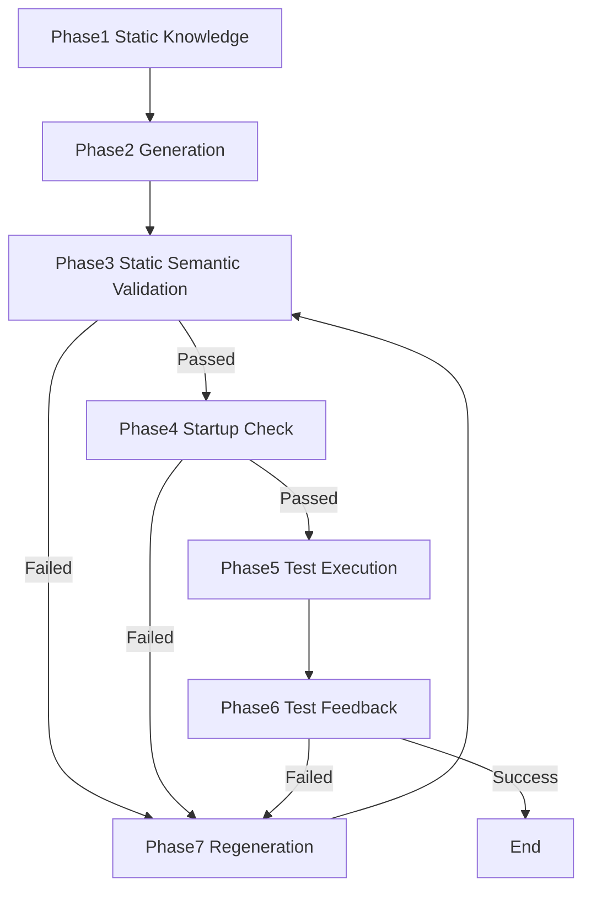

# 📘 Language Ecosystem Evaluation Model for the AI Era (4 Layers × 9 Axes × Verification Loop)

---

## 📌 **About This Document**

This document is created as part of a repository that provides a practical diagnostic prompt for diagnosing causes of AI misinference during code generation and evaluating countermeasures (prompt improvements, additional metadata, explicit validation instructions, etc.) that should be given to AI. Furthermore, as a framework for thinking to theoretically understand why AI misinfers, we devised a language ecosystem evaluation model.

This framework was developed as a **thought experiment** based on practical experience and observations in AI-assisted coding.

**Current Status:**
- ✅ Structured as a theoretical framework
- 🔄 Empirical validation in progress
- 💬 Community-driven extensions welcome

**Design Philosophy:**
- **Tool-agnostic:** Stable across changing AI coding agents and inference models
- **Language-agnostic:** Applicable regardless of programming language evolution
- **Focus on structure:** Identifies mis-inference-prone structures, not specific implementations
- **Long-term stability:** Principles over concrete tools that rapidly evolve

**Scope:**
- ✅ Structural vulnerabilities that cause AI mis-inference
- ⚠️ Non-functional requirements (security, performance) are distributed across the 9 axes as they relate to mis-inference
- ℹ️ Project-specific non-functional requirements may require separate evaluation frameworks

**Future Direction:**  
This framework's structural approach can be adapted to identify mis-inference patterns in other domains (security, performance, etc.) as observation-specific evaluation frameworks.

**How to Use:**
- Use [diagnostic_prompt.md](./diagnostic_prompt.md) for AI-powered diagnostics
  - **Note:** Any AI model can be used for diagnostics
  - **Recommended:** Use with appropriate context and project-specific information
  - **Limitation:** Diagnostic quality depends on the AI model's training data and capabilities
- As a starting point for language selection discussions
- For practical evaluation in actual projects
  - Triggered at project start or when project dependencies are updated
- As inspiration for developing your own evaluation criteria

---

## Abstract

This paper presents a novel framework for evaluating programming language ecosystems in the AI coding era. Unlike traditional metrics focused on syntax or performance, our model prioritizes **"fixability"** — the ability of an ecosystem to support AI's correction loop through rich semantic information.

**Key Contributions:**
- **9-axis evaluation framework** spanning static and runtime dimensions
- **4-layer semantic architecture** (Core, Service, Dependency, Community)
- **Unified theory** treating compilers as semantic verification engines
- **Practical observations** showing tests function as specification complements in dynamic languages

The model presents a hypothesis that in AI-assisted development, language strength is determined not by initial code generation quality, but by the ecosystem's capacity to provide semantic transparency for iterative correction.

**Keywords:** AI-assisted coding, semantic information, language ecosystems, fixability, verification loop

---

## # 0. Introduction  
### **— The Essence of AI Coding is "Fixability"**

The essence of AI coding is not the quality of initial generation,  
but rather these two capabilities:

### **・The ability to fix errors when they occur**  
### **・The ability to accurately provide AI with the information needed for fixes**

In an era where AI continuously generates code,  
what matters is not "producing correct code in one shot",  
but whether we can stably maintain the correction loop of:

- **Correction**  
- **Regeneration**  
- **Verification**

What's needed for this is not the language specification itself,  
but the **quality and quantity of semantic information** provided by  
the entire ecosystem: language, runtime, toolchain, and community.

Starting from this philosophy,  
the evaluation model of **4 Layers × 9 Axes × Verification Loop** was born.

---

# # 1. Purpose of Evaluation Axes  
### **— How to Measure "Language Strength" in the AI Coding Era**

AI is vulnerable to ambiguity, inconsistency, and lack of information.  
Therefore, **consistency, information richness, and stability** of language ecosystems become crucial.

This model adopts the following principles for fair language comparison:

---

## ## 1.1 Prioritize Qualitative Evaluation

Rather than distorting essence through scoring or ranking, we organize the following in "words":

- Language characteristics  
- Strengths for AI  
- Weaknesses for AI  
- Suitable use cases  
- Design philosophy and culture are treated as "differences in values," not "good/bad"  

---

## ## 1.2 Important Axes Vary by Use Case

- **Enterprise** → Stability, backward compatibility  
- **Web / Startup** → Development speed, flexibility  
- **Research / Education** → Expressiveness, experimental features  
- **System / Embedded** → Transparency of runtime semantics  

The quality required for AI-generated code also varies by use case.

---

## ## 1.3 Scope of Evaluation

This model evaluates not just language specifications alone,  
but **the entire ecosystem including language, implementation, toolchain, and community**.

Examples:
- ❌ Python (specification only)
- ✅ Python ecosystem (CPython + pip + pytest + typing + community)

Similarly:
- JavaScript → Node.js / Bun / Deno ecosystem
- C# → .NET ecosystem
- Rust → Cargo ecosystem

This allows evaluation of the **practical environment as a whole**  
that AI faces during actual coding.

---

## ## 1.4 Trade-offs Between Axes

The 9 axes are not independent; the following interactions exist:

### **Stability vs Evolution**
- Axis8 Compatibility Culture ⇔ Axis2 Static Semantic Improvement
- Prioritizing backward compatibility may delay semantic refinement

### **Strictness vs Flexibility**
- Axis3 Metadata Richness ⇔ Axis9 Semantic Extensibility
- Strict type systems can constrain extensibility

### **Information vs Complexity**
- Axis4 Accessibility & Automation ⇔ Learning Cost
- Rich APIs can become barriers for beginners

### **Importance Reversal Between AI and Humans**

Notably, AI and humans have **completely opposite vulnerabilities in terms of which layers** matter most (see Section 5.3 for details).

- **For AI:** Collapse of the Community layer (Layer4) is critical; Core layer (Layer1) has relatively minor impact
- **For Humans:** Collapse of the Core layer (Layer1) is critical; Community layer (Layer4) has relatively minor impact

Therefore, "good languages for AI" and "good languages for humans" do not necessarily align.
Since optimal solutions for these trade-offs vary by use case,  
we adopt **qualitative evaluation rather than scoring**.

---

# # 2. AI Coding Verification Loop

The process by which AI generates, semantically verifies, corrects, and regenerates code  
can be structured into the following 7 phases:

```
Phase1: Static Knowledge (Prior Knowledge)
Phase2: Generation (Initial Generation)
   ├ External Reference
   └ Environment Semantics
Phase3: Static Semantic Verification
Phase4: Launch Check
Phase5: Test Execution
   ├ Phase5-1: Quality Validation (Application/Specification Dependent)
   ├ Phase5-2: Runtime Profiling Observation
   └ Phase5-3: Runtime Profiling Semantics
Phase6: Test Feedback (Runtime Feedback)
Phase7: Regeneration (Corrective Generation)
   ├ External Reference
   └ Environment Semantics
→ Return to Phase3
```



The purpose is singular:

> **Enable AI to "fix" code.  
> Provide all semantic information necessary for that purpose.**

Detailed descriptions of each phase follow.

---

## ## 2.1 Phase1 : Static Knowledge (Prior Knowledge)

- AI's training data (OSS, Q&A, official docs, blogs, etc.)
- Language specifications, standard libraries
- Common coding patterns

## ## 2.2 Phase2 : Generation (Initial Generation)

- Initial code generation by AI
- From prompts and context

## ## 2.3 Phase3 : Static Semantic Verification (Code Semantic Verification)

- Type checking
- Syntax validation
- Linter-based verification
- Build/Compilation (※Cannot reach Phase4 if compilation fails)
- → If failed, go to Phase7

※Here we verify "code semantics (types, syntax, static analysis)".
Syntactic dependency resolution occurs here, but actual executability is verified in Phase4.

## ## 2.4 Phase4 : Launch Check (Environment & Dependency Verification)

- Actual dependency resolution and loading
- Environment variables and configuration file verification
- Basic startup confirmation
- → If failed, go to Phase7
   
※Here we verify "execution environment semantics (dependency existence, environment, initialization)".
Handles cases where compilation succeeds but startup fails due to missing dependencies, unconfigured environment, etc.

## ## 2.5 Phase5 : Test Execution (Runtime Semantic Verification)

- **Phase5-1: Quality validation** (depends on app/spec)
  - Unit tests
  - Integration tests
  - Code review

- **Phase5-2: Runtime profiling observation**
  - Execution performance
  - Resource usage
  - Logging

- **Phase5-3: Runtime profiling semantics**
  - Semantic interpretation based on observation results
  - Detection of anomalies or unexpected behaviors
  - Patterns from execution traces

- → If failed, go to Phase7

## ## 2.6 Phase6 : Test Feedback (Runtime Feedback)

- Error messages
- Test results
- Runtime logs
- Performance bottlenecks

## ## 2.7 Phase7 : Regeneration (Corrective Generation)

- AI regenerates code based on feedback
- Reflect Phase3, Phase4, Phase5, or Phase6 feedback to improve code
- → Return to Phase3 validation loop

---

**Note on terminology:** Throughout this document, we use "verification loop," "correction loop," and "fix loop" to refer to the iterative process of AI-driven code generation, verification, and improvement. These terms are used contextually but refer to essentially the same process.

---

# # 3. 9 Axes × 2-Dimensional Model (Implementation / Runtime)

The 9 axes for evaluating language ecosystems are organized  
along two dimensions: **Implementation (Static)** and **Runtime**.

```
Axis1: Public Knowledge Availability（公開知識の可用性）
Axis2: Static Semantic Consistency（静的意味論の一貫性）
Axis3: Semantic Metadata Richness（意味論的メタデータの豊富さ）
Axis4: Semantic Access & Automation（意味論アクセスと自動化）
Axis5: Runtime Semantic Continuity（実行時意味論の一貫性）
Axis6: Dependency Stability（依存関係安定性）
Axis7: Runtime Specification Conformance（実行時仕様準拠）
Axis8: Compatibility Culture（互換性文化）
Axis9: Semantic Extensibility（意味論拡張性）
```
---

## ## 3.1 Axis1 : Public Knowledge Availability

| Dimension | Role | Examples | Contribution to Verification Loop |
| - | - | - | - |
| Static | Knowledge for AI pre-training | OSS, Q&A, Blogs | Phase1 Static Knowledge, Phase2 Generation |
| Runtime | Knowledge referenced in correction loop | API Docs, Specifications | Phase7 Regeneration basis strengthening |

---

## ## 3.2 Axis2 : Static Semantic Consistency

| Dimension | Role | Examples | Contribution |
| - | - | - | - |
| Static | Static semantic consistency | Types, AST, Scopes | Phase3 Static Semantic Verification |
| Runtime | Runtime semantic consistency | Exceptions, Dynamic types | Phase5-3 Profiling Semantics, Phase5-1 Quality Validation |

---

## ## 3.3 Axis3 : Semantic Metadata Richness

| Dimension | Role | Examples | Contribution |
| - | - | - | - |
| Static | Materials for static analysis | Type annotations, LSP, Contracts | Phase3 Semantic Verification |
| Runtime | Granularity of runtime observation | Profilers, Traces | Phase5-2 Profiling Observation |

---

## ## 3.4 Axis4 : Semantic Access & Automation

| Dimension | Role | Examples | Contribution |
| - | - | - | - |
| Static | Access to semantic APIs | Roslyn, tsserver, Symbol API | Phase3 Verification, Phase4 Launch Check |
| Runtime | Automated execution environment | Test runners, Profilers | Phase5 Test Execution |

---

## ## 3.5 Axis5 : Runtime Semantic Continuity

| Dimension | Role | Examples | Contribution |
| - | - | - | - |
| Static | Consideration of runtime differences | Node/Bun, CPython/PyPy | Phase2 Generation |
| Runtime | Runtime semantic continuity | GC, JIT, Exception models | Phase5-3 Profiling Semantics |

---

## ## 3.6 Axis6 : Dependency Stability

| Dimension | Role | Examples | Contribution |
| - | - | - | - |
| Static | Dependency consistency | Versions, ABI | Phase3 Verification, Phase4 Launch Check |
| Runtime | Runtime dependency behavior | Actual loading | Phase5-1 Quality Validation |

---

## ## 3.7 Axis7 : Runtime Specification Conformance

| Dimension | Role | Examples | Contribution |
| - | - | - | - |
| Static | Semantic fixation based on specs | API Docs, RFCs | Phase2 Generation, Phase3 Verification |
| Runtime | Runtime spec conformance | Behavior per specification | Phase5-1 Quality Validation |

---

## ## 3.8 Axis8 : Compatibility Culture

| Dimension | Role | Examples | Contribution |
| - | - | - | - |
| Static | Use of backward-compatible APIs | Deprecated API warnings | Phase2 Generation, Phase3 Verification |
| Runtime | Operation in legacy environments | LTS, Stable APIs | Phase4 Launch Check, Phase5-1 Quality Validation |

---

## ## 3.9 Axis9 : Semantic Extensibility

| Dimension | Role | Examples | Contribution |
| - | - | - | - |
| Static | Extensible design | Interfaces, Abstractions | Phase2 Generation, Phase3 Verification |
| Runtime | Post-extension behavior validation | Plugins, Modules | Phase5-1 Quality Validation, Phase7 Regeneration |

---

# # 4. 4-Layer Structure (Semantic Layers)

Language ecosystems can be structured into the following 4 layers:

```
Layer1: Semantic Core Layer（意味論コア層）
Layer2: Semantic Service Layer（意味論サービス層）
Layer3: Dependency Semantics Layer（依存関係意味論層）
Layer4: Community Semantics Layer（コミュニティ意味論層）
```

- Layers 1-3 represent "official" semantics
- Layer 4 represents "social" semantics

---

## ## 4.1 Layer1 : Semantic Core Layer

- Type system  
- Scope rules  
- Memory model  
- Evaluation strategy  
- Backward compatibility policy  

**Related Axes:** Axis2, Axis5, Axis8, Axis9  
**Contributions:** Phase3, Phase4, Phase5, Phase7

Represents the language specification itself, including types, scopes, memory models, etc.

---

## ## 4.2 Layer2 : Semantic Service Layer

- AST / Symbol API  
- Type information API  
- Diagnostics & Errors  
- LSP  
- Static analysis API  
- Compiler
- Toolchain
- Custom attributes (Attribute / Annotation / Decorator)
- Comments (natural language / semantic metadata like XML comments)
- Macros / Source Generators
- Analyzer extension points

**Related Axes:** Axis3, Axis4, Axis5, Axis7, Axis9  
**Contributions:** Phase2, Phase3, Phase4, Phase5, Phase7

This is the interface layer that exposes language specifications externally,
allowing AI to acquire, interpret, and modify semantics.

### ## 4.2.1 Role of Layer 2

Layer 2 functions as the "interface layer" that exposes language specifications (Layer 1) externally, enabling AI to acquire, interpret, and modify semantics. Services (mechanisms) for providing feedback from the language side to AI belong here.

Layer 2 integrates static, dynamic, and dependency semantics, serving as "machine-readable semantics" for AI.

It also includes services (toolchain) for verifying, analyzing, and manipulating dependencies. This is because Layer 2 represents "how to handle" dependencies, while Layer 3 represents the "content" of dependencies.

---

## ## 4.3 Layer3 : Dependency Semantics Layer

- Standard library  
- Package management systems (npm, pip, cargo, etc.)  
- Version management and dependency resolution  
- API lifetime (deprecation, breaking changes)  
- Runtime compatibility (ABI, binary compatibility)  

**Related Axes:** Axis6, Axis7, Axis8, Axis9  
**Contributions:** Phase3, Phase4, Phase5, Phase7

In language ecosystems, this layer represents the management, versioning, and compatibility of external libraries and modules that code depends on.
While Layer 2 represents the "mechanisms for handling" these, Layer 3 represents the "semantics of dependencies themselves."

---

## ## 4.4 Layer4 : Community Semantics Layer

- OSS  
- Q&A  
- Blogs  
- Best practices  
- Coding conventions  

**Related Axes:** Axis1, Axis6, Axis8, Axis9  
**Contributions:** Phase1, Phase2, Phase6, Phase7

---

# # 5. Dual Perspectives: AI View / Human View

---

## ## 5.1 AI View (Outside → Center)

```
Community Semantics
    ↓
Dependency Semantics
    ↓
Semantic Service Layer
    ↓
Semantic Core Layer
```

AI absorbs semantics from the outside and understands toward the center (language specification).

In other words, AI infers by reverse-engineering from outer data:
 - First, observe "how humans write" and "how it's used" in large quantities (training data source)
 - Grasp semantics by observing massive API usage patterns
 - Absorb the structural semantics of the language
 - Infer the syntax of the language

---

## ## 5.2 Human View (Center → Outside)

```
Semantic Core Layer
    ↓
Semantic Service Layer
    ↓
Dependency Semantics
    ↓
Community Semantics
```

Humans expand their understanding from the center (language specification) outward.

## ## 5.3 AI and Human Weaknesses Are in Completely Opposite Directions

> When semantic layers break, AI and humans have completely opposite vulnerabilities.

| Layer | AI Vulnerability | Human Vulnerability |
| - | - | - |
| 4 Community | Critical | Minor impact |
| 3 Dependency | Major impact | Moderate |
| 2 Service | Moderate | Major impact |
| 1 Core | Minor impact | Critical |

> AI: Outer-layer dependent → Vulnerable when outer layers break  
> Human: Inner-layer dependent → Vulnerable when inner layers break

## ## 5.4 AI and Human "Strengths/Weaknesses" Are Also Reversed

- What AI is good at:
  - Language conversion (Python → Rust → TS)
  - Pseudocode interpretation
  - Natural language to code generation
  - Semantic refactoring of code

- What humans are good at:
  - Fine nuances of syntax
  - Code style
  - Readability judgment

## ## 5.5 For AI, "Language" Is the Entire Ecosystem, Not Just the Specification

What is "language = spec + grammar" for humans becomes "language = spec + grammar + toolchain + examples + community + culture" for AI.

What humans consider "peripheral information" becomes part of semantics for AI.

In other words, in the AI era, languages are not defined solely by their specifications, but derive meaning through community practice.

We call this perspective **Language-as-Ecosystem** — treating the entire ecosystem as the definition of the language itself.

---

# # 6. Summary  
### **"Fixable Languages" are the Strong Languages of the AI Era**

The essence of AI coding lies in:

- **Fixability**  
- **Semantic Transparency** (ability to provide semantic information)

This model is a framework for structurally evaluating  
how much of a "fixable environment" a language ecosystem can provide to AI.

---

# 📎 **Appendix  
Three Foundational Theories Supporting Language Ecosystems in the AI Era  
— Semantic Layers, Test Culture, Compiler Redefinition —**

This appendix summarizes the **three pillars of philosophy, practical evidence, and unified theory**  
that support the main content (4 Layers × 9 Axes × Verification Loop).

- **Appendix A: Semantic Layers are the True Essence (Core Philosophy)**  
- **Appendix B: Tests Complement Specifications (Practical Observations)**  
- **Appendix C: Redefining Compilers as Semantic Verification Engines (Unified Theory)**

With these three together,  
the AI-era language ecosystem evaluation model is completed as  
a three-layer structure of **Philosophy → Practice → Theory**.

---

# ## Appendix A  
Semantic Layers are the True Essence  
— Moving Beyond Syntax-Centrism —

---

## **A-1. Syntax is Merely "Surface"**

- Language syntax functions as a user interface for both AI and humans  
- Just character strings to AI  
- Same structure if semantics match, regardless of different grammar  
- No fundamental difference between Python, C#, or JavaScript  

> **Syntax is appearance; it is not the essence.**

---

## **A-2. The Essence is the "Semantic Layer"**

What AI needs to run the correction loop is **semantic information**.

### ✔ Static Semantics
- AST  
- Type information  
- Contracts (pre/post/invariant)  
- Metadata  

### ✔ Dependency Semantics
- Runtime versions  
- Standard libraries  
- Breaking change history  

### ✔ Dynamic Semantics
- Runtime behavior  
- Side effects  
- Exception conditions  

These become **the primary information sources for AI's correction loop**.

---

## **A-3. Semantic Layers Should be Externalized**

> **There's no need to embed semantics inside AI models.  
> A structure that follows external semantic layers is optimal.**

This ensures:

- Even if models change  
- Even if vendors change  
- Even if language specifications evolve  

**The stability of the correction loop is maintained.**

---

## **A-4. Appendix A Summary**

> **In the AI era, the true essence of code is the semantic layer,  
> and syntax is the user interface for both AI and humans.**

---

# ## Appendix B  
Test Libraries Function as "Specification Complements"  
— Practical Observations that Language Specifications Alone are Insufficient —

---

## **B-1. Some Languages Make Tests More Critical than Specifications**

Especially in the following languages,  
**the quality of test libraries determines the success of AI coding**:

- Python / Ruby / JavaScript (dynamic typing)  
- Java / TypeScript (type erasure)  
- Go / Java (complex runtime behavior)  

In these languages:

> **AI cannot fix correctly unless runtime specifications are explicitly defined through tests.**

---

## **B-2. Why Tests Become Critical**

For AI to fix code, it needs:

1. **Correct specifications**  
2. **Error location information**  
3. **Runtime reasons (exceptions, logs)**

Language specifications alone often cannot satisfy these requirements.

Therefore:

- Tests  
- Logs  
- Traces  
- Structured errors  
- Reproducible execution environments  

**fill the gaps in specifications**.

---

## **B-3. Tests Play a Different Role in Statically-Typed Languages**

In languages with strong static semantics like C#:

- Type system is robust  
- AST and metadata are rich  

Therefore, tests can focus on:

- Behavioral specifications  
- Concurrency correctness  
- Side effect validation  

These are **supplements to dynamic semantics**.

---

## **B-4. In Dynamic Languages, Tests Function as "De Facto Specifications"**

In Python or JavaScript:

- Types are weak  
- Runtime behavior is ambiguous  

Therefore, tests handle:

- Type information complementation  
- Specification concretization  
- Intent clarification  

and **function as de facto specifications**.

However, this is:

> **Not an assertion that tests should replace specifications,  
> but an observation that they function as practical means to complement incomplete specifications.**

---

## **B-5. Appendix B Summary**

> **Language specifications alone are insufficient.  
> Test culture, toolchains, and logs function as "specification complements"  
> supporting AI's correction loop.**

---

# ## Appendix C  
The AI Era Perspective: Compilation's Value Lies in Semantic Verification  
— A Unified View of Static and Dynamic Languages —

---

## **C-1. Traditional Definition vs AI Era Perspective**

Traditional primary purpose:
> **Compilation = Executable file generation**

AI era perspective:
> **Compilation's primary value = Semantic verification phase  
> For AI, this verification information is what matters**

This does not negate the traditional definition,  
but rather **represents a shift in value perspective within the context of AI coding**.

---

## **C-2. For AI, Compilers are "Semantic Verification Engines"**

In AI's correction loop, compilers provide:

- Core Semantics (types, scopes, evaluation strategies) verification  
- Extended Semantics (Analyzer, Linter) integration  
- Dependency consistency checking  
- Executability assurance  

In other words, from AI's perspective:

> **Compiler = An engine that establishes semantic consistency  
> and provides information necessary for fixes**

Executable file generation is one of the artifacts obtained as a result of this verification.

---

## **C-3. This Redefinition Unifies Static and Dynamic Languages**

### Static Languages  
→ Semantic verification at compile time

### Dynamic Languages  
→ Semantic verification via Linter + Tests

Unified view:

> **The two differ only in "where semantic verification occurs,"  
> but are fundamentally the same structure.**

This enables  
**evaluation of static and dynamic languages within the same framework**.

---

## **C-4. Appendix C Summary**

> **From the AI era perspective, compilation's primary value lies in semantic verification,  
> and this view enables unified treatment of static and dynamic languages.**

---

# 📚 **Glossary**

## Core Concepts

**Fixability**  
The capacity of a language ecosystem to support iterative correction of AI-generated code through provision of rich semantic information.

**Semantic Transparency**  
The degree to which a language ecosystem exposes semantic information (types, contracts, runtime behavior) to AI tools.

**Correction Loop / Fix Loop**  
The iterative process of: Generation → Verification → Feedback → Regeneration, central to AI-assisted development.

---

## Technical Terms

**AST (Abstract Syntax Tree)**  
A tree representation of the abstract syntactic structure of source code, used by compilers and static analyzers.

**LSP (Language Server Protocol)**  
A protocol for communication between development tools and language servers, providing features like autocomplete and diagnostics.

**ABI (Application Binary Interface)**  
The interface between program modules at the binary level, critical for dependency compatibility.

**Type Erasure**  
A compilation technique where generic type information is removed at runtime (e.g., Java, TypeScript), affecting runtime semantic richness.

**JIT (Just-In-Time Compilation)**  
Runtime compilation technique that can affect semantic continuity between development and production environments.

---

## Model-Specific Terms

**Semantic Layers**  
The four-layer architecture of language ecosystems: Core, Service, Dependency, and Community semantics.

**Static/Runtime Dimensions**  
The two perspectives for each evaluation axis: information available at implementation time vs. execution time.

**De Facto Specifications**  
Tests and runtime validation that effectively serve as specifications in languages with weak static semantics.

**Semantic Verification Engine**  
The redefined role of compilers in the AI era: not just code generation, but semantic consistency validation.
